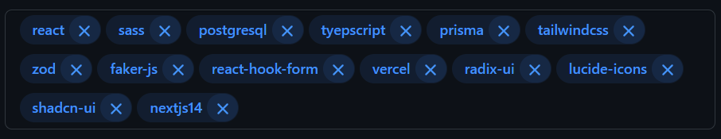
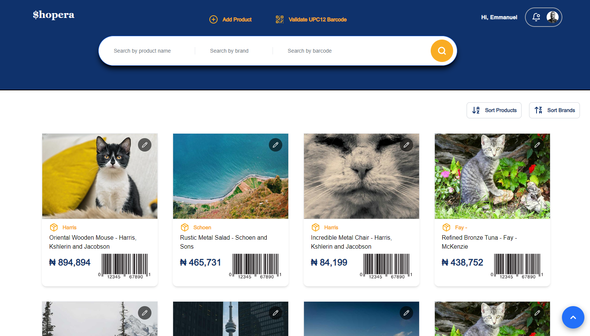
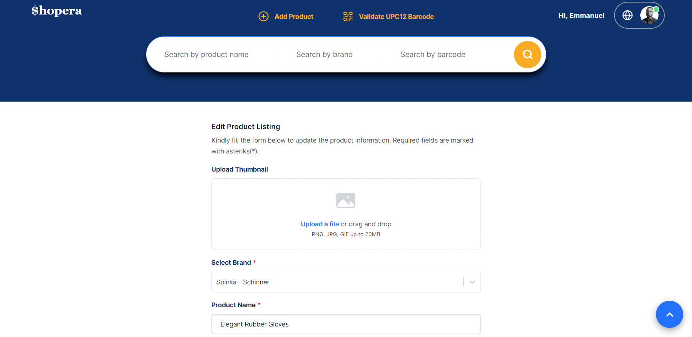
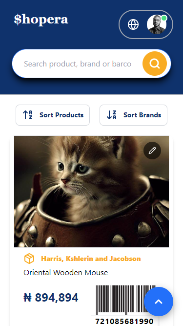
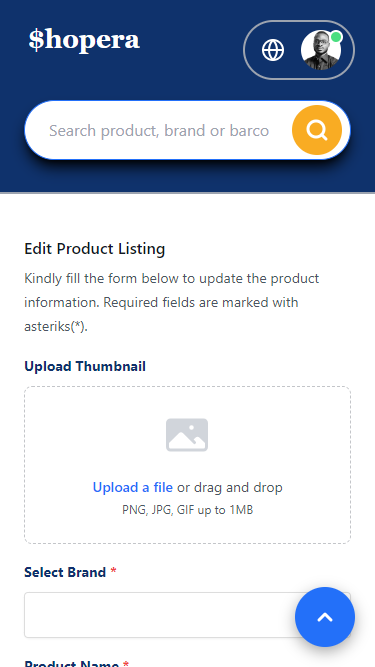
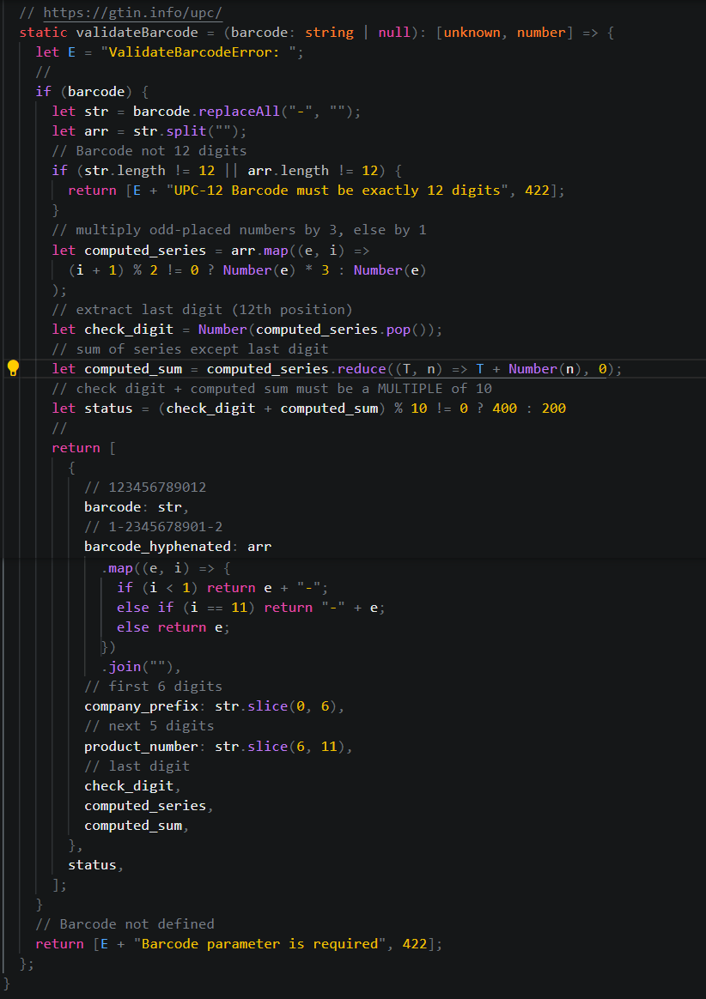

# Peddle Technologies - Full-Stack Developer Assessment

[](https://www.typescriptlang.org/docs/)
[](https://tailwindcss.com/docs/installation)
[](https://www.prisma.io/docs/orm/prisma-client/setup-and-configuration/introduction)
[](https://www.postgresql.org/docs/16/index.html)

[](https://nextjs.org/docs/app/building-your-application/routing/route-handlers)
[](https://shopera.vercel.app)

## Installation

```
$ git clone https://github.com/2gbeh/shopera.git

$ cd shopera

$ npm cache clean --force

$ npm install

$ npm run dev
```

## Usage

> Development: (client) http://localhost:3000/ (server) http://localhost:3000/api/

> Production 🚀🚀🚀: (client) http://shopera.vercel.app/ (server) http://shopera.vercel.app/api/

## API Documentation

> #### [Products Resource](<./src/app/(api)/api/products>)

|    Method | Endpoint                             | Query | Body | Summary                            |
| --------: | :----------------------------------- | :---: | :--: | :--------------------------------- |
|       GET | /products                            |       |      | all (ASC order)                    |
|       GET | /products/[product_id]               |       |      | one                                |
|    ⭐ GET | /products/?like=[search]             |   x   |      | search (product, brand or barcode) |
|    ⭐ GET | /products/validate-barcode/[barcode] |       |      | validate upc-12 barcode            |
|      POST | /products                            |       |  x   | add                                |
|     PATCH | /products/[product_id]               |       |  x   | update                             |
|       PUT | /products/[product_id]               |       |  x   | replace                            |
|    DELETE | /products/[product_id]               |       |      | soft delete (trash)                |
| ⭐ DELETE | /products/[product_id]/?undo=true    |   x   |      | undo delete (restore)              |

> #### [Brands Resource](<./src/app/(api)/api/brands>)

|    Method | Endpoint                      | Query | Body | Summary               |
| --------: | :---------------------------- | :---: | :--: | :-------------------- |
|       GET | /brands                       |       |      | all (ASC order)       |
|       GET | /brands/[brand_id]            |       |      | one                   |
|      POST | /brands                       |       |  x   | add                   |
|     PATCH | /brands/[brand_id]            |       |  x   | update                |
|       PUT | /brands/[brand_id]            |       |  x   | replace               |
|    DELETE | /brands/[brand_id]            |       |      | soft delete (trash)   |
| ⭐ DELETE | /brands/[brand_id]/?undo=true |   x   |      | undo delete (restore) |

## Tech Stack Documentation



## Screenshots

#### Page 1 (Product Listing)



#### Page 2 (Edit Product Listing)



#### Page 1 - Mobile (Product Listing)



#### Page 2 - Mobile (Edit Product Listing)



## 🏆🏆 [My barcode validation algorithm](./src/server/pipes/product.pipe.ts) 🏆🏆



## Known Issues

Added the `.env` file to .gitignore but it did not exclude it, I think it is related to Prisma ORM (not sure).
